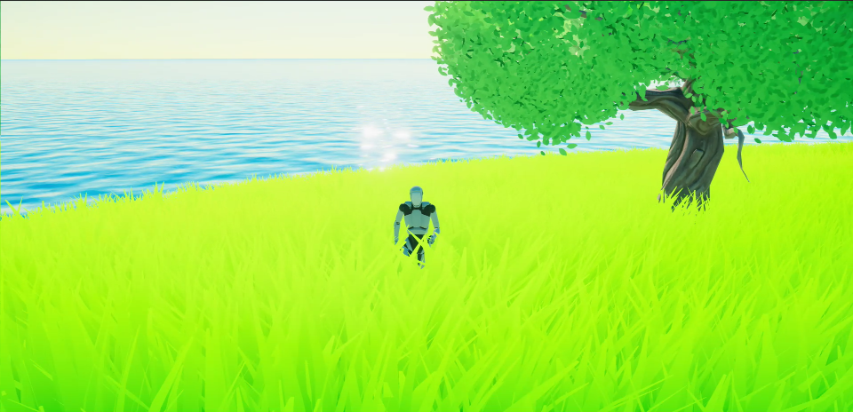

## 基于conpute shader的GPUInstance草地渲染

项目链接：[https://github.com/Li-ZhuoHang/GPUInstance_Grass)](https://github.com/Li-ZhuoHang/GPUInstance_Grass)

### 效果：

基于conpute shader的草地

视锥体裁剪

-16793062208693.gif)

视频效果：[2024技术美术暑假实习生作品集_哔哩哔哩bilibili](https://www.bilibili.com/video/BV11x4y1P7YM/)

